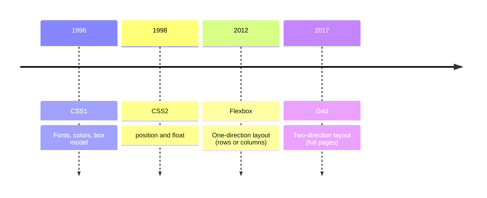

# clone_taobao

Sep 25, 2026, in the age of AI, agents, AI agents, LLM(I cannot explain), bots(Too stressful to follow).....
I am doing a homework, from a CSS course that is at least 10 years old...
Er, er, to do a static website copy, er...er...using CSS2.0, mostly

## CSS Layout Timeline

The technology is from last century, effectively disappeared now. My AI agent tells me don't do this homework; it is stupid and waste of time.
As stubborn as I am, I am going to do it anyway, to learn, to close on the course, also because I have all the time in the world.
